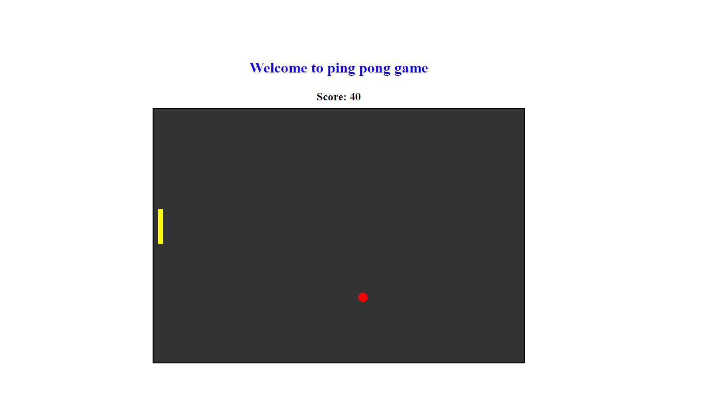

# Ping Pong Game

### Game controls:
1. Player can move the paddle up and down using `up` and `down` keys.
2. Player can move the paddle up and down using **_mouse_**.

### Instructions:
1. For every successfull collision between the paddle and ball, player will get `10 points`.
2. After every successfull collision between the paddle and ball, ***paddle color will change***.

### Glimpse

# Ping-Pong-Game
